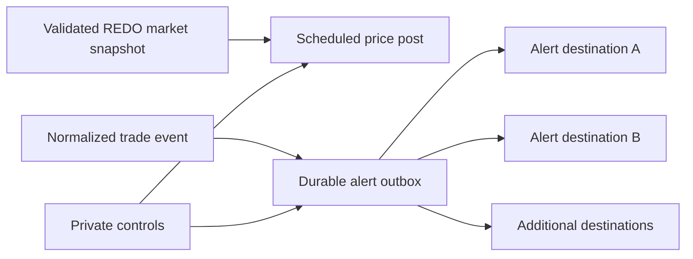

# Architecture

The outbox records delivery progress separately for each configured destination. A retry continues from incomplete work. The queue format, identifiers, provider routes, and Telegram calls are proprietary.
